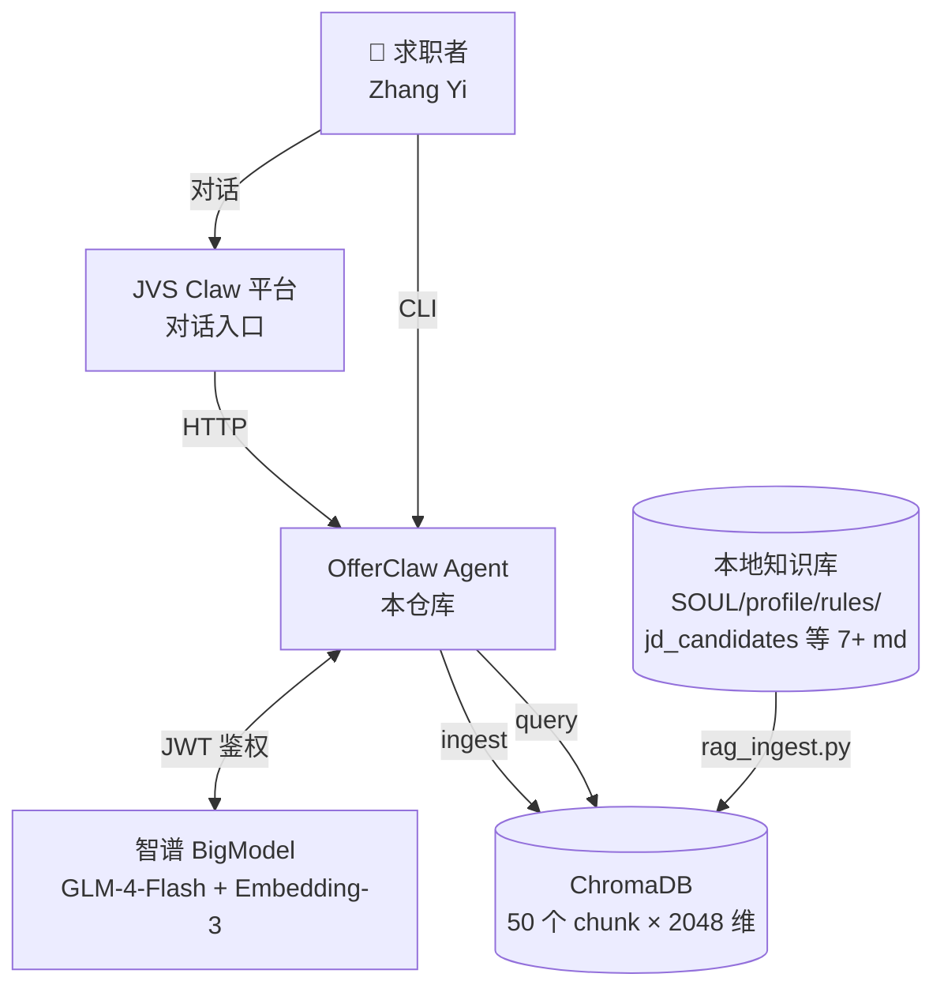
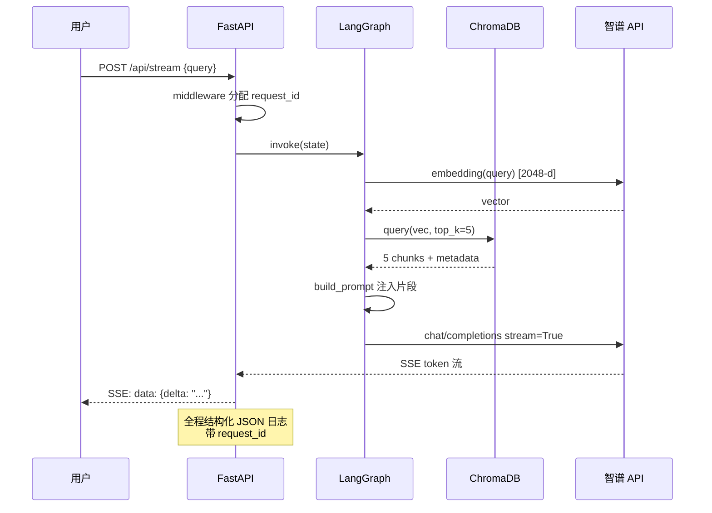
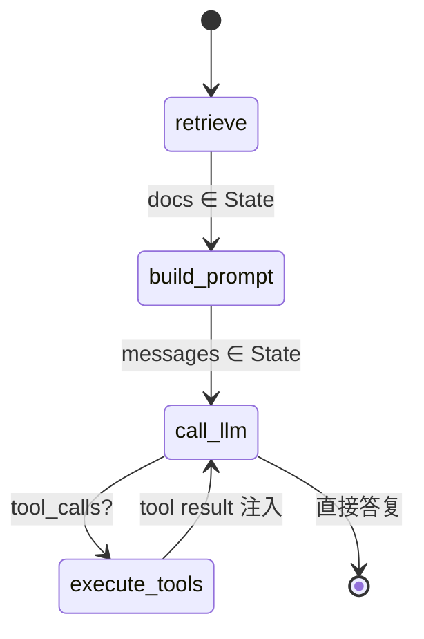

# OfferClaw · 系统架构图

> 本文档描述 OfferClaw V1 的整体架构、数据流、模块职责。
> 配合 README + resume_pitch.md 使用。

## 1. 顶层架构（C4 Context）



## 2. 内部模块依赖

```mermaid
graph LR
    subgraph 入口层
        CLI[rag_agent.py<br/>CLI 单次/交互]
        API[rag_api.py<br/>FastAPI + SSE]
        PIPE[pipeline.py<br/>端到端闭环]
        SUM[summary_tool.py<br/>晚间复盘]
    end

    subgraph 编排层
        GRAPH[rag_graph.py<br/>LangGraph 状态机<br/>retrieve→prompt→llm→tools]
    end

    subgraph 业务层
        MATCH[match_job.py<br/>三档匹配规则]
        PLAN[plan_gen.py<br/>4 周计划生成]
    end

    subgraph 工具层
        TOOLS[rag_tools.py<br/>JWT/Embedding/Chunk/LLM]
        LOG[logging_utils.py<br/>JSON 日志+request_id]
        DEMO[agent_demo.py<br/>智谱 SDK 雏形]
    end

    subgraph 评估层
        EVAL[eval_rag.py<br/>Recall@K + MRR]
        TESTS[tests/<br/>17 pytest 用例]
    end

    CLI --> TOOLS
    API --> GRAPH
    API --> MATCH
    API --> TOOLS
    API --> LOG
    PIPE --> MATCH
    PIPE --> PLAN
    SUM --> DEMO
    GRAPH --> TOOLS
    PLAN --> DEMO
    EVAL --> TOOLS
    TESTS --> MATCH
    TESTS --> TOOLS
    TESTS --> PIPE
    TESTS --> SUM
```

## 3. RAG 数据流（核心闭环）



## 4. LangGraph 状态机



## 5. 关键技术决策

| 选择 | 理由 |
|------|------|
| 智谱 GLM-4-Flash + Embedding-3 | 国产合规、JWT 鉴权清晰、embedding-3 输出 2048 维语义足够 |
| ChromaDB（PersistentClient） | 零运维、SQLite 落盘、本地可重放 |
| LangGraph 状态机 | 显式声明 retrieve→prompt→llm→tools；对应蔚来 JD "调用链路编排" |
| FastAPI + SSE | 流式输出对齐 ChatGPT 体验；middleware 统一日志 |
| 规则 + LLM 混合 | match_job 确定性可解释、plan_gen 用 LLM 生成性内容；不让模型编硬门槛 |
| .env.local + .gitignore | 密钥不入 git，跨设备拉取后只需复制 .env.local |

## 6. 评估指标 (V1 基线)

| 指标 | 数值 | 数据集 |
|------|------|--------|
| Recall@5 | **0.750** (6/8) | OfferClaw 自评集 8 题 |
| MRR | **0.688** | 同上 |
| pytest 通过率 | **17/18** (1 skip) | tests/ |
| 端到端流水线时延 | ~30s | pipeline.py（含 1 次 LLM 调用） |
| SSE 首 token 时延 | ~1-2s | /api/stream |

下一步优化：见 `eval_rag.py` Q6/Q7 miss 案例 → V2 引入 LLM rerank。
